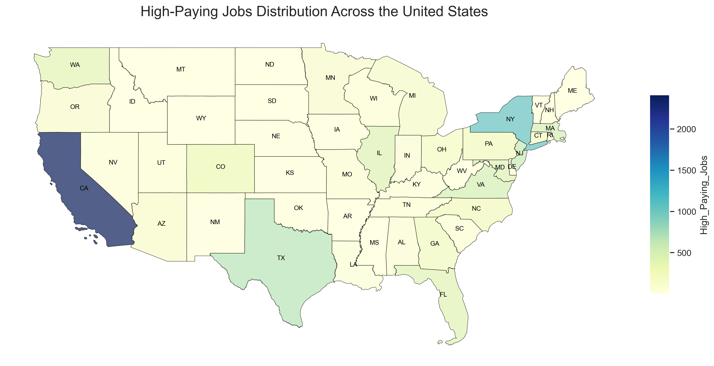
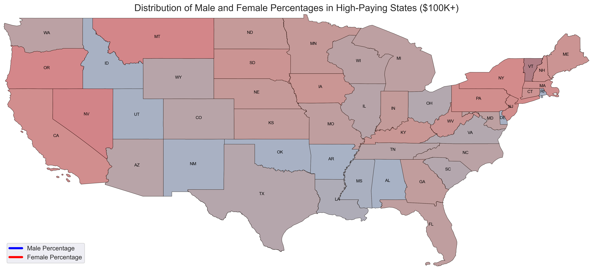

# High-Paying Jobs Analysis: BLS and Census Data  

## Introduction  
This project investigates high-paying jobs (annual salaries of $100K+) in the U.S. by integrating data from the Bureau of Labor Statistics (BLS) and the U.S. Census Bureau. The goal is to uncover trends, geographic patterns, and demographic insights into these occupations.  

---

## Data Sources  

### 1. Bureau of Labor Statistics (BLS)  
- **Dataset**: Occupational Employment and Wage Statistics (OEWS)  
- **Content**:  
  - Employment and wage estimates for various occupations.  
  - Geographic and industry-specific data.  
- **Source**: [BLS OEWS Tables](https://www.bls.gov/oes/tables.htm)  

### 2. U.S. Census Bureau  
- **Dataset**: Educational Attainment and Demographics  
- **Content**:  
  - Individual-level demographic, education, and occupation data.  
- **Source**: [Census Bureau](https://www.census.gov/)  

---

## Data Cleaning  

### Bureau of Labor Statistics (BLS)  
- Filtered columns relevant to the analysis (e.g., `OCC_CODE`, `AREA_TITLE`, `A_MEAN`).  
- Standardized `OCC_CODE` for consistency (removed hyphens and invalid entries).  
- Retained only occupations with annual mean salaries ≥ $100K.  
- Excluded data from non-mainland U.S. regions.  

### Census Data  
- Reformatted `OCCSOC` to match BLS's `OCC_CODE` structure.  
- Decoded categorical columns like `SEX` and `EDUCD` into descriptive labels.  
- Standardized state and region codes for compatibility with BLS data.  
- Removed rows with missing or incomplete entries.  

---

## Data Merging  

### Process  
- **Objective**: Combine datasets to include all relevant columns for matched rows where both `PRIM_STATE` (state abbreviation) and `OCC_CODE` (occupation code) align.  
- **Steps**:  
  1. Merged using an inner join on `PRIM_STATE` and `OCC_CODE`.  
  2. Checked for missing values and verified data integrity.  
  3. Renamed columns for clarity using a mapping dictionary.  
  4. Dropped redundant columns.  

### Output  
- **File**: `cleaned_high_pay_data.csv`  
- **Content**: A unified dataset containing:  
  - **Geographic Details**: State and area names.  
  - **Occupation Details**: Codes, titles, and employment numbers.  
  - **Wage Data**: Hourly and annual wages (mean and median).  
  - **Demographics**: Gender, age, education levels, and degree fields.  

---

## Key Features of Cleaned Data  

1. **Geographic Analysis**:  
   - Data categorized by state and region.  

2. **Wage Analysis**:  
   - Both hourly and annual salaries for each occupation.  

3. **Demographics**:  
   - Variables like age, gender, and education level included.  

4. **Consistency**:  
   - Standardized codes for seamless integration and analysis.  

---

## Objectives  

1. **National Trends**:  
   - Identify which occupations dominate the $100K+ category.  

2. **Geographic Insights**:  
   - Discover regions with the highest concentrations of high-paying jobs.  

3. **Demographic Analysis**:  
   - Examine the role of gender, age, and education in earning potential.  

4. **Educational Impact**:  
   - Assess how educational attainment correlates with high-paying occupations.  
---
## Analysis & Results

# High-Paying Jobs Analysis

This part presents a detailed analysis of high-paying jobs ($100K+ annual income) across various states in the U.S. The analysis utilizes mapping techniques to visualize the distribution of these jobs, their concentration, the educational qualifications required, and gender representation in high-paying roles.

## Summary of Findings

The analysis reveals significant insights into the landscape of high-paying jobs in the U.S.:

1. **Distribution of High-Paying Jobs**: States like California, New York, and Texas dominate in the absolute number of high-paying jobs, reflecting their large economies and diverse industries.

2. **Concentration of High-Paying Jobs**: States such as Maryland, Virginia, and Washington show a high concentration of high-paying jobs relative to their total employment, indicating specialized industries and economic hubs.

3. **Educational Requirements**: The dominant education level for high-paying jobs varies by state, with a Bachelor's degree being the most common. However, states like North Dakota highlight the importance of professional degrees in specific sectors.

4. **Gender Distribution**: The analysis indicates a notable gender disparity in high-paying jobs, with certain states exhibiting male dominance in industries like tech and engineering, while others show a higher representation of women in sectors such as healthcare and education.

---

## Question 1: Which states have the highest number of high-paying jobs ($100K+ annual income)?
### Plot:

### Insight:
- **North Dakota (ND)**: North Dakota ranks as the state with the highest average income, largely driven by high-paying sectors such as oil, energy, and healthcare. The state's relatively small population creates a competitive market for skilled workers, further driving up wages.
- **South Dakota (SD)**: South Dakota benefits from industries like finance, insurance, and healthcare, along with a favorable tax structure that includes no state income tax. This makes it an attractive state for high earners, further contributing to the state's robust economy.
- **Maine (ME)**: Maine has high-paying jobs concentrated in sectors like healthcare, technology, and management. The state’s appeal also lies in its strong quality of life, which attracts professionals seeking high-paying roles in a more serene, less urbanized environment.
  
These states highlight how local industries, workforce needs, and state policies (such as tax structure) contribute to the distribution of high-paying jobs across the U.S. Additionally, these states demonstrate that high wages are not solely a result of large economies but also reflect the unique economic advantages and policies each state offers.

---

## Question 2: ## Which states have the highest number and the highest concentration of high-paying jobs ($100K+ annual income)?

### Plot 1: Number of high-paying jobs in top states

### Plot 2: Location Quotient (LQ) of high-paying jobs across U.S. states
(Insert a map or chart showing the Location Quotient of high-paying jobs across U.S. states)

### Insight:
The analysis of both the absolute number of high-paying jobs and the relative concentration (Location Quotient - LQ) reveals important regional trends:

- **States with the highest absolute number of high-paying jobs ($100K+ annual income):**
    - **California (CA)**: Leading the nation due to its large economy and industries like tech, healthcare, and entertainment.
    - **New York (NY)**: With a robust presence in finance, healthcare, and technology, New York has numerous opportunities for high-paying jobs.
    - **Texas (TX)**: Driven by sectors such as energy, healthcare, and expanding tech, Texas supports a significant number of high-paying jobs.

- **States with the highest concentration of high-paying jobs (Location Quotient - LQ):**
    - **Maryland (MD)**: High concentration of federal jobs and defense-related industries.
    - **Virginia (VA)**: Strong presence of government contractors and tech companies.
    - **Washington (WA)**: A major tech hub with aerospace industries, leading to a high concentration of high-paying jobs.
    - **Iowa (IA)**: Disproportionate concentration of specialized industries, such as insurance and agribusiness.
    - **Colorado (CO)**: A thriving tech and energy sector results in a higher-than-average concentration of high-paying roles.

This combined analysis shows that states like **California**, **New York**, and **Texas** dominate in the absolute number of $100K+ jobs, while states like **Maryland**, **Virginia**, and **Washington** excel in the relative concentration of high-paying jobs, often due to their specialized industries or proximity to economic hubs.

---

## Question 3: What is the dominant education level for high-paying jobs (earning $100K+) across different states, and how does this reflect regional job market demands?

### Insight:
In analyzing the dominant education levels for high-paying jobs ($100K+), the results reveal distinct regional variations:
- **Bachelor's Degree**: The most common education level for high-paying jobs across the majority of states. It is the dominant qualification in almost all states except North Dakota, where professional degrees are more prominent. States like California, Texas, and New York fall into this category, with industries that value a wide range of skills typically obtained with a Bachelor's degree.
  
- **Master's Degree**: The dominant qualification in NE, MT, SD, MO, and WV. These states have industries where advanced skills and expertise (typically gained from Master's programs) are highly valued, such as in healthcare, business, and technology.
  
- **Professional Degree**: Found as the dominant education level in North Dakota (ND). This suggests that sectors like law, healthcare (e.g., physicians, lawyers), and other specialized professions are the primary drivers of high-paying job opportunities in the state.
  
- **Doctoral Degree**: Although doctoral degrees are important in fields like research and academia, they do not appear as the dominant qualification for high-paying jobs across any state in the U.S.

---

## Question 4: What is the gender distribution in high-paying jobs ($100K+) across different states?
### Plot: Gender distribution in high-paying jobs across U.S. states

### Insight:
The gender distribution in high-paying jobs ($100K+) varies significantly across states, with certain regions showing a higher concentration of either male or female workers in top-paying positions:

- **Male-Dominated States:** 
    - **Idaho (ID)**, **Utah (UT)**, **Oklahoma (OK)**, **Arkansas (AR)**, and **New Mexico (NM)** exhibit a higher percentage of men in high-paying jobs. 
    - This trend is likely driven by industries traditionally dominated by males, such as **tech**, **engineering**, and **skilled labor**. 
    - Cultural factors may also play a role, with certain states seeing more gender-specific career choices in high-income sectors, often influenced by regional or societal expectations.

- **Female-Dominated States:** 
    - **Nevada (NV)**, **Oregon (OR)**, **California (CA)**, **New York (NY)**, and **Montana (MT)** show a higher percentage of women in high-paying roles. 
    - These states often have significant representation of women in **healthcare**, **education**, and **service industries**, where high-paying opportunities are more available to women. 
    - Additionally, states like **California** and **New York**, with more diverse and inclusive job markets, provide more opportunities for women in leadership and specialized roles, contributing to a higher percentage of women in top-paying jobs.

This analysis shows how industry sectors, state-specific economic structures, and cultural factors shape gender representation in high-paying occupations across the country.

---

### U.S. Map Interpretation:
Based on the analysis thus far, we have identified key regional trends and demographic patterns in the distribution of high-paying jobs across the U.S. These insights highlight notable industry and geographic concentrations, as well as gender disparities, which provide a foundational understanding of the $100K+ job market.

- Industry Trends: Sectors such as technology, healthcare, and management emerge as strong areas for high-paying roles, particularly for those with relevant educational backgrounds.
- Geographic Distribution: States like California, New York, and Texas dominate in terms of high-paying job opportunities, especially in tech and finance, while other states are emerging hubs for healthcare and renewable energy industries.
- Gender Representation: There is clear evidence of gender disparities, with some states showing higher concentrations of women in high-paying positions. This offers valuable insights for career navigation, especially for women in the workforce.
These initial findings provide a clear snapshot of the landscape for high-paying jobs, but there is significant potential to explore further. Delving deeper into factors such as industry-specific growth trends, the evolving role of education, and regional policy impacts could offer even more nuanced insights for job seekers and employers.

---

## Conclusion:
This project successfully integrates and prepares two comprehensive datasets, providing a robust foundation for analyzing high-paying jobs in the U.S. The cleaned and merged data offer valuable insights into the trends, demographics, and geographic distribution of $100K+ occupations.

The analysis reveals distinct regional variations in the types of high-paying jobs, as well as the demographics of the workforce. Factors such as industry specialization, state policies, and regional cultural dynamics significantly influence the availability and distribution of high-income jobs across the country. Understanding these patterns is essential for both employers and job seekers to navigate the competitive $100K+ job market effectively.

This study lays the groundwork for further exploration into how education, gender representation, and evolving industry trends shape high-paying job opportunities, offering a strategic framework for career planning and workforce development.