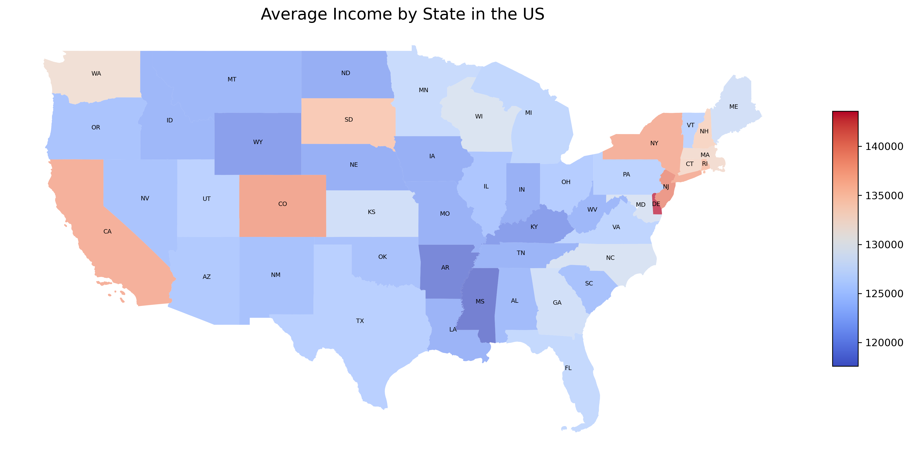
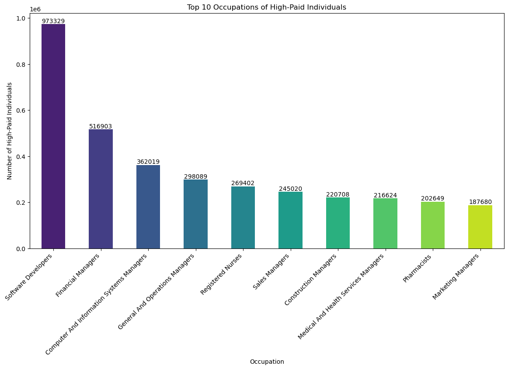
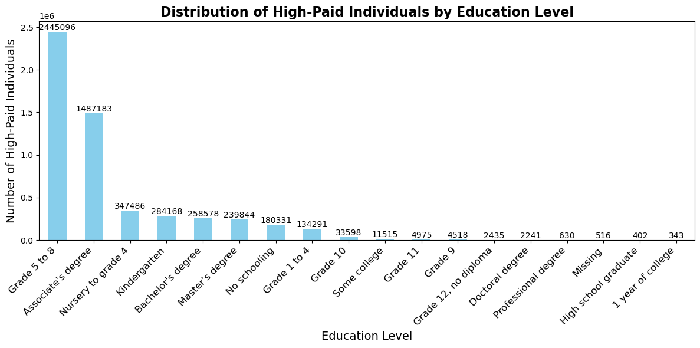
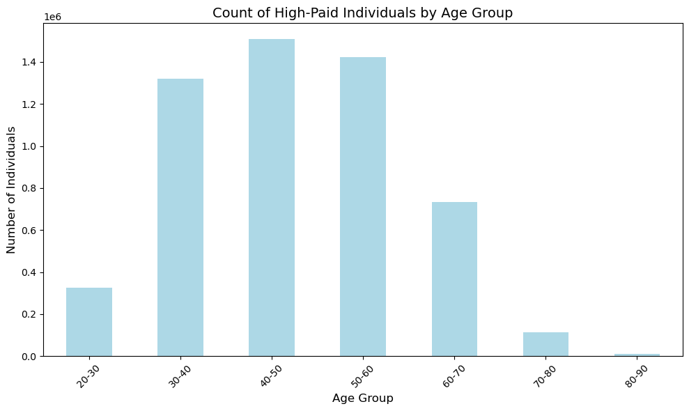

# **High-Paying Jobs Analysis: U.S. Job Market Insights**

This project explores high-paying jobs in the U.S. using data from the Bureau of Labor Statistics (BLS) and census data. Through data analysis and visualization, we uncover insights into salaries, demographics, education levels, and state-by-state distributions.

---

## **Table of Contents**
1. [Introduction](#introduction)
2. [Data Collection and Cleanup](#data-collection-and-cleanup)
3. [Analysis and Visualizations](#analysis-and-visualizations)
   - [Key Findings](#key-findings)
   - [Questions Answered](#questions-answered)
4. [Challenges Encountered](#challenges-encountered)
5. [Future Directions](#future-directions)
6. [Acknowledgments](#acknowledgments)

---

## **Introduction**
This project aims to analyze the distribution and determinants of high-paying jobs in the U.S. Using a combination of BLS occupational wage data and demographic information from census datasets, the analysis provides insights into:
- State-level and national trends.
- The relationship between salary, education, gender, and occupation.
- Geographic patterns and demographic distributions.

---

## **Data Collection and Cleanup**
### **Steps Taken**
- Collected and merged **BLS data** (state-specific and national) with **census demographic data**.
- Cleaned datasets by handling missing values, ensuring proper merges, and aligning key fields such as `OCC_CODE` (BLS) and `OCCSOC` (census).
- Filtered data to focus on individuals earning $100K or more.
- Transformed geographic data to include state-level shapefiles for mapping.
- Added derived variables (e.g., education levels and gender categories).

---

## **Analysis and Visualizations**
### **Key Findings**
- **Geographic Trends**:
  - States like **Delaware, New York, California**, and **Colorado** have the highest concentrations of high-paid individuals.
  - Coastal states outperform inland states in high-paying job distributions.

- **Occupational Insights**:
  - Dominant occupations include **software developers**, **financial managers**, and **information systems managers**.

- **Gender Disparities**:
  - Males dominate in terms of the count of high-paid individuals, while females show higher average annual mean wages in some occupations.

- **Educational Influence**:
  - Higher-paying roles often correlate with mid-level educational attainment (e.g., associate degrees).

### **Questions Answered**
#### **1. Distribution of High-Paid Individuals Across States**
- **Visualization**: Map of high-paid individuals by state (Figure 1).
- **Key Insight**: Coastal states lead, with Delaware topping the list.

#### **2. Most Common Occupations Among High-Paid Individuals**
- **Visualization**: Bar chart of top occupations (Figure 2).
- **Key Insight**: Technology and finance-related jobs dominate.

#### **3. Gender Influence**
- **Visualization**: Side-by-side comparison of gender-based distributions (Figure 3).
- **Key Insight**: Males dominate numerically, but females often earn slightly higher average wages.

#### **4. Education Level Impact**
- **Visualization**: Scatterplot of education levels vs. high-paying job counts (Figure 4).
- **Key Insight**: Intermediate education levels (grades 5–8 and associate degrees) show the highest high-paid counts.

#### **5. Age Distribution of High-Paid Individuals**
- **Visualization**: Histogram of age distributions (Figure 5).
- **Key Insight**: Individuals in their 30s–40s are most represented in high-paying roles.

---

## **Challenges Encountered**
- Differentiating national vs. state-level data in the BLS dataset.
- Mapping education levels onto geographic data required significant data processing and validation.
- Handling inconsistent or missing demographic data during merging.
- Correlation analysis revealed weak relationships between salary and numerical features, requiring deeper exploration.

---

## **Future Directions**
- Integrate machine learning models for predicting high-paying jobs based on demographic and regional factors.
- Explore time series trends in high-paying job growth across industries and regions.
- Enhance the analysis by incorporating more granular data, such as industry-specific growth rates.

---

## **Acknowledgments**
This project utilized publicly available data from:
- **U.S. Bureau of Labor Statistics (BLS)**
- **Census Bureau Demographic Files**

Special thanks to team members and instructors for guidance and feedback.

---

## **Visualizations**
### **1. Distribution of High-Paid Individuals Across States**

### **2. Most Common Occupations Among High-Paid Individuals**

### **3. Gender-Based Distribution**

### **4. Education Levels and High-Paying Jobs**

### **5. Age Distribution of High-Paid Individuals**

