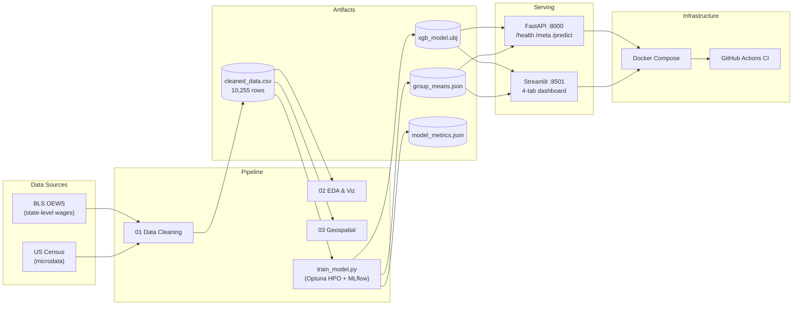

# High-Paying Jobs in the US — Salary Quantile Predictor

[](https://huggingface.co/spaces/MarwaBS/high-pay-salary-predictor)
[](https://www.python.org/)
[](LICENSE)
[](https://github.com/MarwaBS/High_pay_Analysis_us/actions/workflows/ci.yml)
[](MODEL_CARD.md)
[](api/main.py)
[](Dockerfile)

> **🤗 [Try the live demo on Hugging Face Spaces →](https://huggingface.co/spaces/MarwaBS/high-pay-salary-predictor)**
> A single Docker container runs both the FastAPI service and the Streamlit
> dashboard. The Predictor tab calls `POST /predict` on the co-located API,
> so cache hits, rate limiting, drift monitoring, and benchmark lookups all
> flow through one prediction path.

> **What this is**: a portfolio project that analyses high-paying US
> jobs (≥ $100K/yr) and serves an XGBoost **quantile** model (P10/P50/P90)
> through a FastAPI endpoint with a Streamlit dashboard on top.
>
> **What it is not**: a deployable salary predictor. The model operates
> on a truncated `INCTOT ≥ $100K` cohort and returns an honest
> uncertainty range, not a precise dollar estimate. See
> [MODEL_CARD.md](MODEL_CARD.md) for the full framing, limitations, and
> fairness discussion. The model is scored on calibrated quantile
> coverage, not on R² — point-estimate R² is a weak fit-statistic under
> a quantile loss.

## Key Findings

| Finding | Detail |
|---|---|
| **Gender pay gap (EDA, not model)** | Welch t-test on the cleaned dataset gives Cohen's *d* ≈ 0.27 for the male/female income gap within the same occupation and state. Persists after controlling for education and region. |
| **Age dominates what the model can learn** | Permutation importance on the v1 point estimator: Age had the largest unique ΔR². Quantile model unchanged on feature inputs. |
| **Education premium** | Bachelor's → Doctoral ~$45K median jump in EDA. |
| **Regional disparity** | Northeast workers earn the most (EDA); model has the narrowest P10–P90 spread there. |
| **Data-prep ceiling** | The cleaning notebook double-filters the cohort (`INCTOT ≥ 100K` × `A_MEAN ≥ 100K`), which puts a hard upper bound on what a point estimator can achieve. The quantile reframe addresses the right question for the available data. |

---

An end-to-end data science pipeline analysing high-paying jobs (≥ $100K/yr) across all 50 US states, integrating **Bureau of Labor Statistics (BLS) OEWS** and **US Census** microdata. Covers data cleaning, EDA, geospatial mapping, an XGBoost **multi-quantile** model (P10/P50/P90), a FastAPI serving layer with Redis-backed caching and distributed drift detection, and a Streamlit dashboard.

**Keywords:** salary prediction, XGBoost, SHAP, MLflow, FastAPI, Streamlit, BLS OEWS, US Census, data science portfolio, income inequality analysis, feature engineering, CI/CD

---

### Dashboard preview

```
┌─────────────────────────────────────────────────────────────────────────┐
│  💼 High-Paying Jobs in the US                                          │
│  ─────────────────────────────────────────────────────────────────────  │
│  Sidebar filters:          │  Overview  │  Geographic  │  Predictor  │  │
│  • Region(s)               │                                            │
│  • Education Level(s)      │  10,255 records  │  $168K avg  │  CA  │   │
│  • Income range ($)        │                                            │
│                            │  [Top 15 Occupations bar chart]            │
│                            │  [Avg Income by Education bar chart]       │
│                            │  [Gender distribution violin plot]         │
│                            │  [US choropleth — income / LQ / count]     │
│                            │  [Salary predictor form → live estimate]   │
│                            │  [SHAP feature importance + residuals]     │
└─────────────────────────────────────────────────────────────────────────┘
```

> **To see the live dashboard:** run `make dashboard` or `docker compose up --build`,
> then open [http://localhost:8501](http://localhost:8501).

---

## Architecture



**Core design principle:** `pipeline.py` is the single source of truth — all feature definitions, engineering logic, and model I/O are shared across the API, dashboard, training script, and tests. No duplication.

---

## Pipeline overview

The project is organized across four notebooks and two deployable services:

| Notebook | Purpose |
|----------|---------|
| `high_pay_jobs_data_cleaning.ipynb` | Data integration & cleaning (BLS + Census → single dataset) |
| `high_paying_jobs_data_visualization.ipynb` | EDA: distributions, rankings, correlations |
| `us_high_income_jobs_mapping.ipynb` | Geospatial: choropleth maps by state |
| `04_salary_prediction_model.ipynb` | **ML: XGBoost + LightGBM + SHAP + statistical tests + MLflow** |

All figures are saved automatically to `Images/` at 300 DPI.

---

## Quickstart — one command

```bash
make install      # create .venv and install all dependencies
make test         # run the full test suite (unit + integration + performance)
make dashboard    # Streamlit dashboard → http://localhost:8501
make api          # FastAPI server    → http://localhost:8000
make docker       # build + start both services via Docker Compose
make mlflow       # MLflow tracking UI → http://localhost:5000
```

**All `make` targets:**

| Target | What it does |
|--------|-------------|
| `make install` | Create `.venv`, install `requirements.txt` |
| `make data` | Re-run cleaning notebook → `Data/cleaned_high_pay_data.csv` |
| `make model` | Train XGBoost model via `scripts/train_model.py` → `models/` |
| `make test` | Run all pytest tests with `-v` (unit + integration + performance) |
| `make test-fast` | Same, quiet output |
| `make coverage` | Tests + HTML coverage report in `htmlcov/` |
| `make lint` | `ruff check` (fast linter, replaces flake8) |
| `make format` | `ruff format` (opinionated auto-formatter, Black-compatible) |
| `make type-check` | `mypy` static type checker on `api/`, `pipeline.py`, `scripts/` |
| `make dashboard` | Streamlit on port 8501 |
| `make api` | FastAPI + uvicorn on port 8000 |
| `make docker` | `docker compose up --build` |
| `make mlflow` | MLflow tracking UI on port 5000 |
| `make clean` | Remove `models/`, `__pycache__`, `.pytest_cache`, `htmlcov/` |
| `make clean-all` | `clean` + delete `.venv` |

---

## Manual setup (no make)

```bash
python -m venv .venv
source .venv/bin/activate          # Linux/macOS
.\.venv\Scripts\Activate.ps1       # Windows PowerShell
pip install -r requirements.txt
pre-commit install                 # install git quality hooks
```

---

## Model performance (v2.0.0 — quantile reframe)

The primary SLO is **calibrated quantile coverage**, not R². See
[MODEL_CARD.md](MODEL_CARD.md) for the full rationale.

| Metric | Value | Notes |
|--------|-------|-------|
| 80% empirical coverage | **~0.77** | Fraction of test targets inside `[P10, P90]`. Target 0.80 ± 0.05. |
| Median PI width | ~$112K | Typical 80% interval spread in dollar space. |
| Quantile crossings | **0** | P10 > P50 or P50 > P90 — must stay zero. |
| P50 R² (backward-compat point view) | ~0.03 | **Expected to be low** — P50 under quantile loss is the median minimiser, not the mean minimiser. R² is a weak fit-statistic for this objective. |
| CV R² (5-fold, train-only, dollar) | ~0.03 ± 0.02 | Same space as test R² — no overfitting, no space mismatch. |
| Train / test | 8,204 / 2,051 | `random_state=42` |

> **Why is the point-estimate R² so low?** Two reasons:
> 1. The training cohort is double-filtered (Census `INCTOT ≥ 100K` × BLS `A_MEAN ≥ 100K`), pre-removing most of the occupation-wage signal — see [MODEL_CARD.md § Data-prep caveat](MODEL_CARD.md).
> 2. Under a quantile objective, P50 minimises absolute error, not squared error, so R² (which rewards mean-minimisers) is the wrong scoring rule.
>
> The v1.0.0 value of R² = 0.077 (with MLflow + Optuna HPO) was not higher because of better modelling — it was higher because it was trained with squared-error loss and scored with a squared-error metric. That's a tautology, not progress.

**Prediction intervals** are emitted directly by the multi-quantile XGBoost model. The API response includes explicit `predicted_p10`, `predicted_p50`, `predicted_p90` fields; `predicted_salary` is kept as an alias for `predicted_p50` for backward compatibility with v1 clients.

### API performance benchmarks

Measured with FastAPI TestClient (single process, no cache):

| Endpoint | p50 | p95 | p99 |
|----------|-----|-----|-----|
| `POST /predict` | 10ms | 13ms | 14ms |
| `GET /health` | 2ms | 3ms | 3ms |
| `GET /meta` | 2ms | 3ms | 3ms |

**Throughput:** ~87 predictions/sec (single process). SLO: `/predict` p99 < 200ms — enforced in CI via `tests/test_performance.py`.

---

## Portfolio highlights

Grouped by the engineering discipline they demonstrate.

### Modelling

- **Multi-quantile XGBoost.** `reg:quantileerror` with α=[0.10, 0.50, 0.90] in a single model. API returns `predicted_p10 / p50 / p90` directly. Honest uncertainty beats a rationalised point estimate — see [MODEL_CARD.md](MODEL_CARD.md) for the rationale.
- **Target-encoding leakage eliminated.** `Occ_Mean_Income` and `State_Mean_Income` are computed from the training split only, saved to `models/group_means.json`, and loaded at API startup. A dedicated integration test (`tests/test_integration.py::test_no_occ_mean_leakage`) locks this in.
- **Collinearity removal.** `Annual Mean Wage` was dropped after VIF analysis (VIF = 5.44×10⁸ against `Hourly Mean`). 10 features total.
- **CV = Test space.** 5-fold CV runs on the training set only, scored in dollar space via `make_scorer(expm1)`, so `cv_r2_mean` and test `r2` are directly comparable.

### API

- **FastAPI + Pydantic v2** with `/health`, `/meta`, `/predict`, `/metrics`, `/drift`, `/docs`. Routes are thin: domain validation → cache lookup → encode → infer → build response. Business logic lives in `api/inference.py`, not the route handler.
- **Redis-backed prediction cache.** `api/cache.py` is wired into `/predict` via `api.main.cache` with graceful no-op when `REDIS_URL` is unset. Tested with `MagicMock` — no live Redis required for CI.
- **O(log n) benchmark lookup.** `(state, education)` benchmark stats are precomputed at startup into a dict of sorted arrays; `/predict` does a dict get + `np.searchsorted` instead of a per-request DataFrame mask.
- **X-Forwarded-For-aware rate limiting.** `slowapi` key function reads the trusted-hop-adjusted client IP from `X-Forwarded-For`, configurable via `TRUSTED_PROXY_HOPS`. Without this, every caller behind an ingress shares one bucket.
- **Explicit CORS header list** (`Content-Type`, `X-API-Key`, `X-Request-ID`) — no meaningless wildcard+explicit mix.
- **API key auth** (optional via `API_KEY` env var), closed-by-default CORS origins, structured JSON logging with `X-Request-ID` correlation.

### Observability

- **Prometheus metrics** via `prometheus-fastapi-instrumentator`, exposed at `/metrics`.
- **Distributed drift monitor.** `api/drift.DriftMonitor` uses a shared Redis list for the rolling window, so multi-replica Deployments aggregate cluster-wide. Falls back to an in-process deque when Redis is absent. Tested with a fake Redis shared between two monitor instances.
- **Request tracing.** Every request carries an `X-Request-ID` (inbound or generated) through the logs.

### Security & Reproducibility

- **Blocking `pip-audit` CVE gate** in CI with documented suppressions in `.pip-audit-ignore.txt`.
- **Pinned Docker builds.** `requirements-api.txt` holds exact versions for the API runtime. The `api` and `dashboard` Docker stages use separate builders so the API image does not pull `shap` / `lightgbm` / `streamlit` / `statsmodels` it never uses.
- **No pickle.** Model stored as XGBoost native `.ubj`; all other artefacts as plain JSON.
- **Pydantic config validation.** `api/main.py` loads config through `ProjectConfig.from_yaml(...)` at import time — typos or invalid values fail the liveness probe before traffic hits the pod.

### Deployment

- **Kubernetes manifests.** `k8s/api-deployment.yaml` uses a SHA-pinned image tag placeholder (`IMAGE_TAG_PLACEHOLDER`), an `initContainer` that pulls the model + dataset from object storage into an `emptyDir` (no RWX PVC dependency — works on EBS / GCE PD / Azure Disk), pod-level `securityContext` enforcing non-root, a `preStop` 15s graceful-drain hook, and a `PodDisruptionBudget` guaranteeing 1 pod Ready during voluntary disruptions. `hpa.yaml` autoscales 2–10 pods on CPU/memory.
- **Multi-stage Dockerfile.** Non-root user, HEALTHCHECK, separate builders for API vs dashboard.
- **Docker Compose** includes a Redis service with a healthcheck gate so `api` only starts when Redis is responsive.

### Tests

- **116 tests.** Unit (config, data schema, feature engineering, `api/inference.py` helpers), integration (leakage proof, round-trip group-means persistence, end-to-end P50 sanity), drift (detection, rolling window, zero-std edge, Redis shared-backend aggregation), cache (miss/hit/normalised-key/default-noop), and performance (in-process latency, throughput).
- **Regression guards against the metrics file.** `test_saved_metrics_within_expected_range` reads `model_metrics.json` and enforces bands on P50 R² / MAE / RMSE and — crucially — on quantile coverage (`0.72 ≤ cov ≤ 0.88`) and crossings (`== 0`). A regression fails the build loudly.
- **Quantile-output sanity tests.** Ensure `predict_quantiles` produces `p10 ≤ p50 ≤ p90`, ordering-crossings are clamped in `build_response`, and the API surfaces the quantile fields.

---

## Data

**Sources:**
- U.S. Bureau of Labor Statistics (BLS): state-level Occupational Employment and Wage Statistics (OEWS)
- U.S. Census Bureau: microdata — demographics, education, occupation

**Cleaned dataset:** `Data/cleaned_high_pay_data.csv` — 10,255 rows × 15 columns

**Key fields:** Occupation, Annual Income, Education Level, Gender, State Abbreviation, Hourly Mean, Location Quotient, Employment, Jobs per 1000.
(`Annual Mean Wage` is in the raw dataset but was dropped from model features — VIF = 5.44×10⁸ collinearity with `Hourly Mean`.)

Data are used for educational and analytical purposes only. Consult each provider's terms for reuse.

---

## Data cleaning and preparation

Implemented in `high_pay_jobs_data_cleaning.ipynb`:

**BLS cleaning:**
- Normalize strings; strip whitespace and title-case state/occupation names
- Remove hyphens from OCC_CODE; drop invalid codes
- Convert numerics; drop missing values; keep 50 US states only
- Define "high-paying" cohort: `A_MEAN ≥ 100,000` or `H_MEAN ≥ 48.08` (≈ $100K annualized)

**Census cleaning:**
- Extract 6-digit SOC from OCCSOC (zero-padded); decode SEX / STATEICP / EDUCD / DEGFIELDD
- Drop rows with missing key fields

**Integration:**
- Inner join on `[OCC_CODE, STATE]`
- Reorder and rename columns to a tidy schema; remove duplicates
- Final output: `Data/cleaned_high_pay_data.csv` (10,255 × 15)

---

## How to run

```bash
# 1. Install dependencies
pip install -r requirements.txt

# 2. (Optional) Install git quality hooks
pre-commit install

# 3. Run EDA notebooks (open in Jupyter)
jupyter notebook

# 4. Train the model
python scripts/train_model.py

# 5. Launch the interactive dashboard
streamlit run streamlit_app.py

# 6. Run the test suite
pytest tests/ -v
```

### Run with Docker (one command, no Python setup needed)

```bash
docker compose up --build
# Dashboard → http://localhost:8501
# API docs  → http://localhost:8000/docs
docker compose down
```

### Run the API locally

```bash
uvicorn api.main:app --reload --port 8000
```

**Key API endpoints:**

| Method | Path | Description |
|--------|------|-------------|
| `GET` | `/health` | Liveness probe — model loaded, dataset rows |
| `GET` | `/meta` | Valid states, occupations, education levels |
| `POST` | `/predict` | Salary prediction + percentile + group benchmarks (auth + rate limited) |
| `GET` | `/metrics` | Prometheus metrics (request counts, latency histograms) |
| `GET` | `/drift` | Feature drift report (z-score vs training baseline) |
| `GET` | `/docs` | Auto-generated Swagger UI |

**Example request:**
```bash
curl -X POST http://localhost:8000/predict \
  -H "Content-Type: application/json" \
  -d '{"state":"CA","occupation":"Software Developers","education_level":"Bachelor'\''s degree","gender":"Female","age":32}'
```

### MLflow experiment tracking

After running notebook 4, compare all model runs:
```bash
make mlflow   # open http://localhost:5000
```
Logged per run: model type, hyperparameters, R², RMSE, MAE, CV R² mean ± std, and model artefact.

---

## Findings with figures

**Top occupations by average income**

Chief Executives, Physicians, and Lawyers lead. STEM software roles cluster just below — occupation choice is the strongest signal in the dataset, outranking state, education, and demographics for predicting whether someone earns above the cohort median.

**Average income by education level**

Each ordinal step adds income: the Bachelor's → Doctoral gap is ~$45K in medians. However, within-tier variance is high — a Bachelor's-degree Software Engineer often out-earns a Doctoral-degree academic, confirming that education alone is insufficient and occupation context is necessary.

**Salary distributions for top occupations**

Right-skewed distributions with long upper tails in every role — the primary justification for the `log1p` target transform. Surgeons and CEOs show the widest spread, driven by equity compensation and bonuses not captured in the dataset.

**Correlation among numeric features**

`Hourly Mean` and `Annual Mean Wage` show near-perfect correlation (r ≈ 0.9999). Both cannot coexist in a model — VIF confirms multicollinearity (5.44×10⁸). `Annual Mean Wage` was removed; `Hourly Mean` was retained. Annual Income shows weak correlation with BLS headcount metrics, confirming that individual income is driven by within-occupation factors not captured at the aggregate BLS level.

**Age vs annual income**

Age is the **single strongest predictor** (permutation ΔR²=0.112, ranking above occupation and BLS wage signals). Income rises steeply from 22–40, plateaus 40–65. Age acts as a proxy for seniority, negotiating experience, and accumulated tenure — unobserved variables that the model captures indirectly.

**Gender distribution across top occupations**

Male representation dominates in most high-paying occupations, with the largest gaps in Engineering and Executive roles. The composition gap partly explains the observed pay gap but Welch t-test confirms it persists *within* occupation-state cells (Cohen's *d* = 0.27, *p* < 0.001).

**Gender distribution across top states**

Female representation in the $100K+ cohort is highest in DC, MD, and VA — states with large government/healthcare/education sectors where gender-pay gaps tend to be smaller than private-sector tech and finance.

**Gender distribution by education (within $100K+)**

At every education tier, male workers outnumber female within the $100K+ cohort. The gap is smallest at the Doctoral level — consistent with academic/research roles having narrower pay dispersion — and largest at the Professional degree level (law, medicine).

**Distribution of $100K+ individuals by state**

CA, NY, TX, and FL lead in absolute headcount (large populations). MD, VA, and WA punch above their weight on a per-capita basis, reflecting federal contractor and tech cluster concentration.

**Average income by state (bar)**

New England and Mid-Atlantic states dominate average income. The model captures this through `Region_Code` and `State_Mean_Income` — Northeast R² (0.097) is the highest of the four regions, confirming regional signal is real and learnable.

**Location Quotient by state**

MD, VA, DC and WA show LQ > 1.5, meaning high-paying jobs are over-represented relative to national employment share. These states, not the largest by population, are the densest clusters of premium roles — an insight job seekers optimizing for salary should weight over absolute headcount.

**Dominant education level by state**

Bachelor's degree dominates most of the contiguous US for $100K+ earners. Master's is modal in select Midwest states; Professional degrees lead in ND. This geographic clustering reflects industry mix (oil & gas, agriculture, manufacturing) rather than education ROI differences.

**Education–income premium by state**

The education premium varies 2–3× across states. High-LQ tech states (WA, CA) show lower marginal returns to advanced degrees — top-tier individual contributors without graduate degrees still earn at or above the state median. High-premium states tend to be smaller markets with concentrated professional services.

**Market size vs education premium**

Larger labor markets show a mild *negative* correlation with education premium — supporting the hypothesis that large, competitive markets (NYC, SF) compress the education signal and reward occupation/skill specificity instead.

**Average income by US Census region**

Northeast leads in mean ± std income. South and Midwest show lower means with wider distributions. The model's subgroup analysis confirms this: Northeast test R²=0.097, South R²=0.067 — the Northeast is the most predictable region because industry mix is more homogeneous within occupation cells.

## Map gallery (choropleths)

Average income by state (map)


High-paying jobs distribution (map)


Location Quotient by state (map)


Dominant education by state (map)


Gender share overlays (map)


---

## Case interpretation and results

- **Geographic:** Large economies (CA, NY, TX) lead in absolute headcount. Concentration (LQ) peaks in MD, VA, WA — specialized clusters drive premium roles.
- **Education ROI:** Bachelor's degrees dominate most states for $100K+ roles. Master's is dominant in SD, MT, NE, MO, WV; Professional in ND.
- **Demographic:** Gender participation is uneven across occupations and states. Age–income patterns plateau later in career.
- **Market dynamics:** Bigger markets often pair with higher education premiums, but industry composition (tech / finance / healthcare) matters more than market size alone.
- **Correlations:** Employment and jobs-per-1000 move together. Annual income shows weak correlation with headcount — reinforcing the primacy of occupation and geography.

### Recommendations

**Job seekers:** Target states with strong concentration (LQ) for your field, not just volume. Align degree investments with target regions.

**Employers:** Calibrate compensation to regional wage dynamics. Recruit across clusters where talent density is highest.

**Policymakers:** Direct workforce and education funding toward regional specializations.

### Limitations

- Analysis covers a single timeframe; nominal incomes (no cost-of-living adjustment applied).
- No causal inference; descriptive and exploratory focus.
- Industry deep-dives and longitudinal trends would refine signals.

See `reports/data_science_report.md` for the full analyst-oriented narrative.

---

## Repository structure

```
High_pay_Analysis_us/
│
├── pipeline.py                                # ★ Single source of truth: FEATURES + engineer_features + shared helpers
├── config_schema.py                           # ★ Pydantic validation for config.yaml (fail-fast on typos)
│
├── Notebooks
│   ├── high_pay_jobs_data_cleaning.ipynb      # Pipeline: BLS + Census → cleaned CSV
│   ├── high_paying_jobs_data_visualization.ipynb  # EDA: distributions, rankings, correlations
│   ├── us_high_income_jobs_mapping.ipynb      # Geospatial: choropleth maps
│   └── 04_salary_prediction_model.ipynb       # ★ ML: XGBoost + SHAP + statistical tests + MLflow
│
├── streamlit_app.py                           # ★ Interactive dashboard (run with streamlit)
├── config.yaml                                # ★ All thresholds, paths, color palettes
├── Dockerfile                                 # ★ Multi-stage build: dashboard + api (non-root)
├── docker-compose.yml                         # ★ Two services: dashboard (8501) + api (8000)
├── Makefile                                   # ★ install / data / model / test / lint / format / clean
├── pyproject.toml                             # ★ Ruff, mypy, pytest, coverage configuration
├── .pre-commit-config.yaml                    # ★ ruff, nbstripout, file hygiene hooks
│
├── api/
│   ├── main.py                                # ★ FastAPI app: /health /meta /predict /drift /metrics
│   ├── schemas.py                             # ★ Pydantic v2 request/response models
│   └── drift.py                               # ★ Online drift monitor (z-score vs training baseline)
│
├── scripts/
│   └── train_model.py                         # ★ Standalone model training script (replaces Makefile one-liner)
│
├── tests/
│   ├── conftest.py                            # ★ Shared session-scope fixtures (cfg, df, group_means, df_engineered)
│   ├── test_pipeline.py                       # ★ Config, schema, feature engineering, model prediction (45 tests)
│   ├── test_api.py                            # ★ API endpoints, validation, prediction (22 tests)
│   ├── test_integration.py                    # ★ Full pipeline path: split → group_means → engineer → predict (10 tests)
│   └── test_performance.py                    # ★ Latency SLOs, throughput benchmarks (6 tests)
│
├── Data/                                      # Processed datasets (single source of truth)
│   ├── cleaned_high_pay_data.csv              #   10,255 rows × 15 cols
│   ├── bls_data.csv
│   └── census_data.csv
│
├── Resources/                                 # Raw source data
│   ├── bls_state_data.xlsx
│   └── census_data.csv
│
├── models/                                    # Saved ML model artefacts (generated, no pickle)
│   ├── xgb_salary_model.ubj                   #   XGBoost native binary (portable)
│   ├── feature_names.json                     #   Feature list (10 features)
│   ├── group_means.json                       #   Training-set occ/state means (leakage-free inference)
│   └── model_metrics.json                     #   R², RMSE, MAE, CV R², PI offsets, subgroup metrics, permutation importance
│
├── Images/                                    # Auto-saved figures (300 DPI)
│
├── reports/
│   └── data_science_report.md                 # Analyst-oriented narrative and findings
│
├── k8s/                                       # ★ Kubernetes manifests (deployment, service, HPA, PDB, configmap)
│
├── .github/workflows/
│   └── ci.yml                                 # ★ GitHub Actions CI/CD: lint + test + audit + Docker build/push
│
├── requirements.txt                           # Pinned runtime + dev dependencies
├── requirements-lock.txt                      # pip freeze — exact transitive deps for full reproducibility
├── CONTRIBUTING.md                            # Contribution guide
└── LICENSE                                    # MIT
```

---

## Reproducibility

- **Single source of truth:** all notebooks and services consume `Data/cleaned_high_pay_data.csv` and `pipeline.py`.
- **Config-driven:** thresholds, paths, and palette live in `config.yaml` — never hardcoded.
- **96 tests:** unit (config, data schema, feature engineering, model prediction, config schema validation) + integration (leakage proof, group-means round-trip, end-to-end R²) + drift detection + performance (latency SLOs, throughput benchmarks).
- **CI/CD:** GitHub Actions runs lint + tests on every push (Python 3.10 and 3.11). `pip-audit` runs as a **blocking** CVE gate. On merge to main: Docker images auto-built, pushed to GHCR, and smoke-tested.
- **Dependabot:** weekly automated dependency and GitHub Actions version updates.
- **Exact lock file:** `requirements-lock.txt` pins all 133 transitive dependencies.
- **Pre-commit hooks:** ruff linting/formatting and nbstripout run automatically on every commit.
